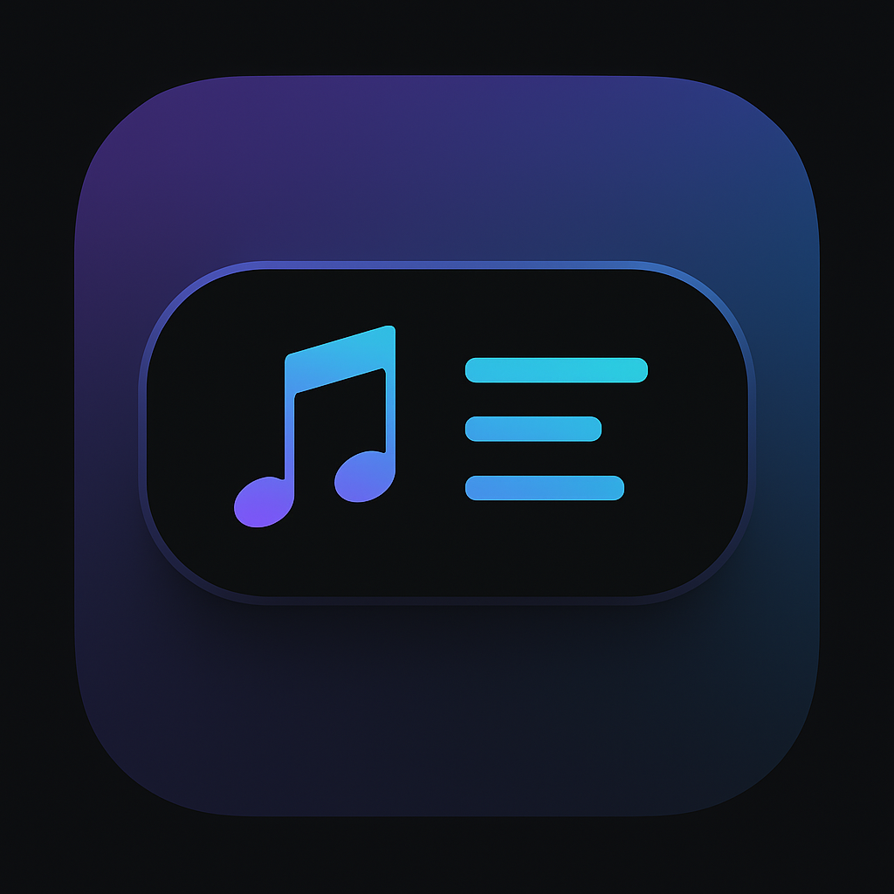
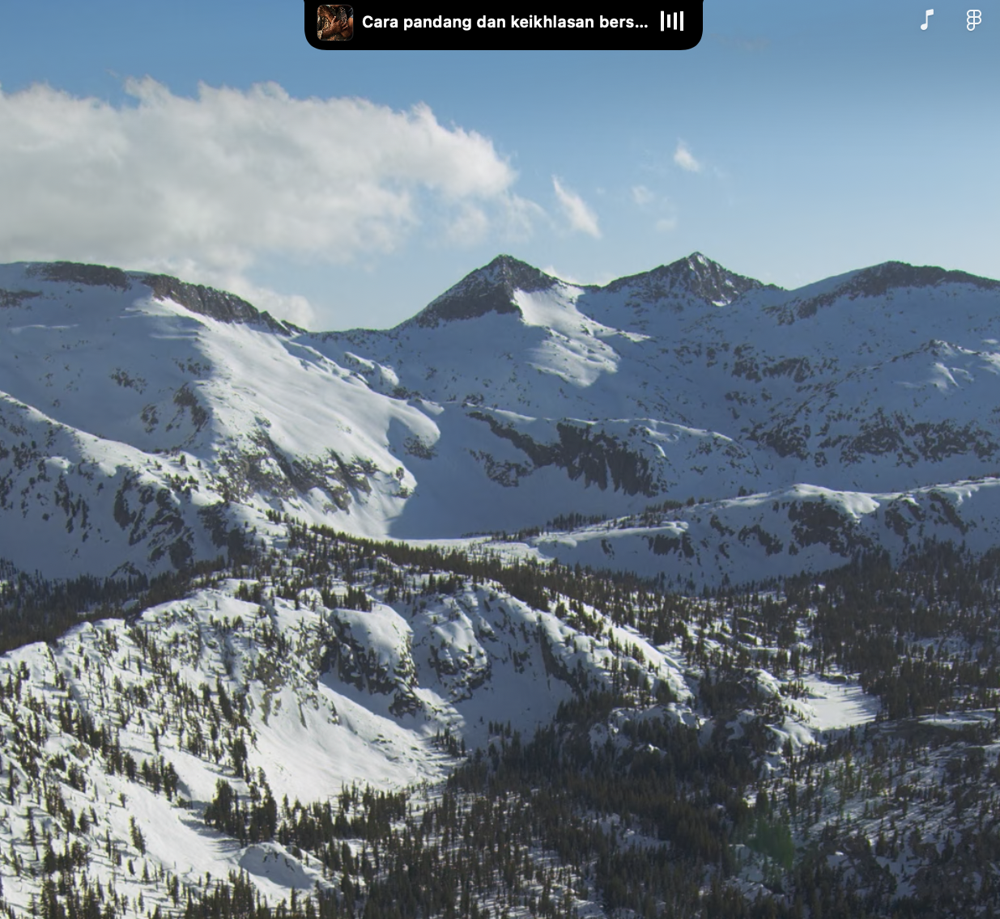
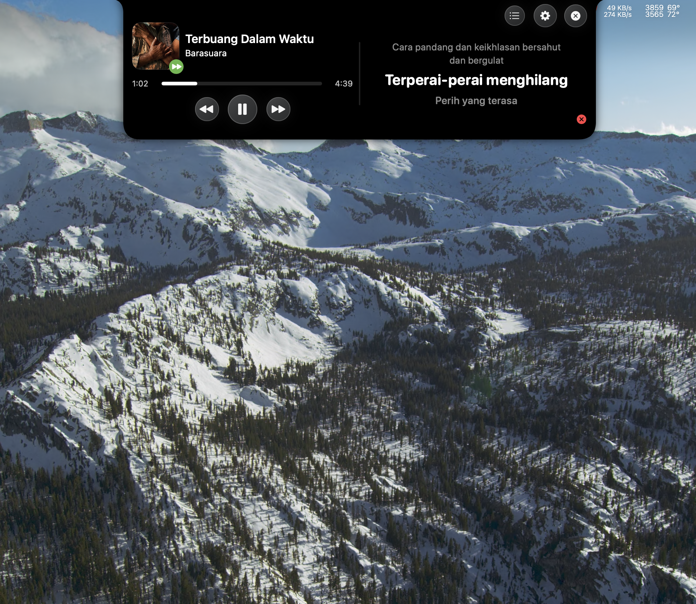
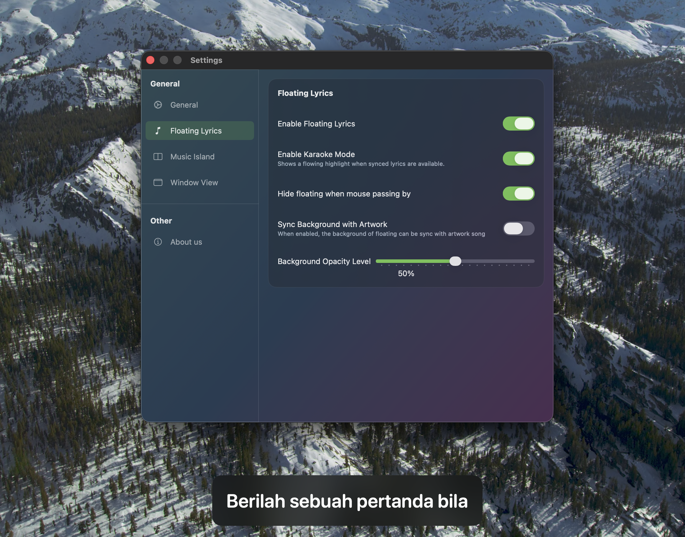

<div align="center">



# VLyrics
**Escape the Player. Read between the lines.**

[](#)
[](#)
[](#)
[](#)

<br>

**[Website](https://vlyrics.ariidjsdev.site)** • **[Download Latest Release](#-installation)** • **[Report a Bug](../../issues)**

<br>

<p align="center">
  
  
</p>
<p align="center">
  
  
</p>
<p align="center"><i>VLyrics adapting to your workspace: Notch mode, Expanded view, Floating widget, and Player Sync.</i></p>

</div>

---

## 📖 The Story
Streaming platforms lock your lyrics inside clunky interfaces, artificially limiting API calls and forcing you to keep their bulky windows open just to sing along. 

**VLyrics breaks the glass.** It extracts the lyrics from the constraints of the player and places them natively on your macOS desktop. Whether it acts as a Dynamic Island, a menu bar notch, or a free-floating widget, VLyrics stays out of your way and exactly where you need it. Because you already pay for the stream—you shouldn't have to pay for the words.

---

## 🎧 Supported Players

VLyrics taps directly into macOS's native media controllers. If your Mac knows what's playing, so do we. Out of the box, we fully support:

<p align="left">
  
  
  
</p>

* **Apple Music:** Full integration with the native macOS desktop app.
* **Spotify:** Flawless syncing with the official Mac client.
* **YouTube Music:** Seamless detection via the browser's "Now Playing" broadcast (works with Safari, Chrome, Arc, and unofficial desktop wrappers).

*(Note: As long as your browser or app broadcasts its current track to the macOS Control Center, VLyrics can catch it and display the lyrics!)*

## ✨ Why You'll Love It

| Feature | Description |
| :--- | :--- |
| 🏝️ **Spatial UI** | Choose your vibe: a sleek top-notch, a hovering dynamic island, or a floating window. |
| 🎯 **Always On Top** | Never lose your lyrics beneath Xcode, Figma, or your browser. It floats seamlessly above your workflow. |
| ⚡ **Player Agnostic** | Pulls lyrics independently. It doesn't rely on the restricted APIs of your music player to find what you're listening to. |
| 🍎 **Native macOS** | Written entirely in Swift and AppKit/SwiftUI. It's incredibly lightweight, fast, and feels like it ships with macOS. |
| 💸 **Zero Subscriptions** | No premium tiers. No paywalls. 100% open and free forever. |

---

## 🚀 Installation

### The Easy Way (Recommended)
1. Download the latest [Here](https://github.com/ariidjs/VLyrics-App/releases/latest/download/VLyrics.dmg).
2. Open the file and drag **VLyrics** into your `Applications` folder.
3. Launch the app and grant the necessary macOS permissions (Accessibility/Media).

#### If the app not showed up, go to System Settings

1. Try to open the app — you'll see a security warning.
2. Click **OK** to dismiss it.
3. Open **System Settings** > **Privacy & Security**.
4. Scroll to the bottom and click **Open Anyway** next to the VLyrics warning.
5. Confirm if prompted.

#### If the above solution doesn't work too try this (Recommended)
- Make sure you already move the VLyrics inside the Applications folder.
- Open Terminal
- Paste this command : 
```bash
xattr -dr com.apple.quarantine /Applications/VLyrics.app
```
- Then try open the app.
---
## Inspired by
- [LyricsX](https://github.com/ddddxxx/LyricsX)
=> since this project doesn't not have development recently, i try to make this project.